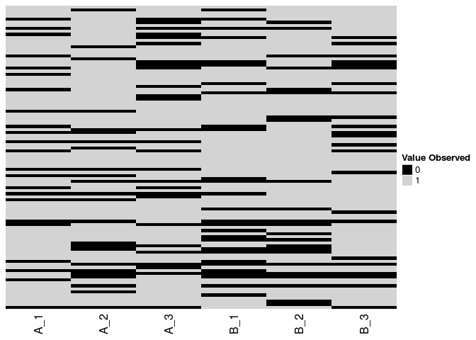

proDD
================

Differential Detection with Label-free Mass Spec Data

Overview
--------

This package provides a framework to find proteins in mass spec data that are differentially detected between groups. It is designed to deal with high number of missing values (i.e. zeros) and can nonetheless give reliable significance estimates.

It is thus applicable to data from affinity purification experiments such as BioID.

Method
------

The algorithm is build around the fact that a missing values are more likely to occur if the intensity of protein is low, which means that a missing observation can tell us something. In the first step the algorithm quantifies this dependency by estimating a logistic regression of the chance to miss a value depending on the underlying intensity. This model is fitted using Hamiltonian Monte Carlo method, because precise estimates of the sigmoid are necessary for reliable downstream calculations. In the second step the group means for each condition and protein are estimated using a maximum likelihood approach. To find which groups are actually significantly expressed in the last step a moderated t-test is applied to each protein.

Unlike other approaches that have been suggested in the literature that rely on imputing missing values using *ad hoc* methods, such as just using half the global minimum, proDD exploits the information provided by the zeros in a structured way and focuses on the MLE of the group means, which are sufficient to establish significance.

Workflow
--------

Installation

``` r
# Install directly from github
devtools::github("const-ae/proDD")
```

Let's assume that `X` is a matrix where each row contains the intensity for one protein and each column is one sample, which can be grouped into conditions.

``` r
library(proDD)
head(X, n=10)
#>             A_1      A_2      A_3      B_1      B_2       B_3
#>  [1,]  8.948989 8.875991 7.482544 8.594879 9.128812  9.232242
#>  [2,] 10.410121 0.000000 7.270870 0.000000 8.084933 11.146074
#>  [3,] 10.039548 8.132201 7.121631 8.522549 8.788616  8.409449
#>  [4,]  9.245942 8.565342 9.208379 8.890867 8.200967  9.788023
#>  [5,]  0.000000 8.327141 0.000000 0.000000 8.240226  7.742693
#>  [6,]  8.996338 8.523116 0.000000 8.341438 0.000000  9.133077
#>  [7,]  8.691698 9.202072 8.976798 8.934317 8.409691  9.428554
#>  [8,]  0.000000 8.453424 0.000000 0.000000 0.000000  8.091614
#>  [9,]  8.703376 9.269610 8.638653 8.564245 7.982265  8.123688
#> [10,]  0.000000 6.698293 0.000000 8.406282 7.689577  8.156681
```



For subsequent steps a description of the samples is necessary, i.e. which sample belongs to which condition. For this we will create a dataframe containing that information:

``` r
data_description <-  data.frame(Condition=as.factor(c(rep("A", 3), rep("B", 3))), 
                                Replicate=c(1:3, 1:3))
data_description$Sample <- paste0(data_description$Condition, data_description$Replicate)
data_description
#>   Condition Replicate Sample
#> 1         A         1     A1
#> 2         A         2     A2
#> 3         A         3     A3
#> 4         B         1     B1
#> 5         B         2     B2
#> 6         B         3     B3

design <-  model.matrix(Sample ~ Condition - 1, data_description)
design
#>   ConditionA ConditionB
#> 1          1          0
#> 2          1          0
#> 3          1          0
#> 4          0          1
#> 5          0          1
#> 6          0          1
#> attr(,"assign")
#> [1] 1 1
#> attr(,"contrasts")
#> attr(,"contrasts")$Condition
#> [1] "contr.treatment"
```

Now we can apply the algorithm that consists of three steps to that data

1.  Estimate the parameters for the variance moderation:

    ``` r
    vm_est <- estimate_variance_moderation(X, design)
    ```

2.  Estimate the sigmoid that describes the chance to miss an observation:

    ``` r
    sig_est <- estimate_sigmoid(X, data_description, vm_est$nu_est, vm_est$sigma2_est, chains=1)
    #> 
    #> SAMPLING FOR MODEL 'estimate_sigmoid' NOW (CHAIN 1).
    #> 
    #> Gradient evaluation took 0.000426 seconds
    #> 1000 transitions using 10 leapfrog steps per transition would take 4.26 seconds.
    #> Adjust your expectations accordingly!
    #> 
    #> 
    #> Iteration:    1 / 2000 [  0%]  (Warmup)
    #> Iteration:  200 / 2000 [ 10%]  (Warmup)
    #> Iteration:  400 / 2000 [ 20%]  (Warmup)
    #> Iteration:  600 / 2000 [ 30%]  (Warmup)
    #> Iteration:  800 / 2000 [ 40%]  (Warmup)
    #> Iteration: 1000 / 2000 [ 50%]  (Warmup)
    #> Iteration: 1001 / 2000 [ 50%]  (Sampling)
    #> Iteration: 1200 / 2000 [ 60%]  (Sampling)
    #> Iteration: 1400 / 2000 [ 70%]  (Sampling)
    #> Iteration: 1600 / 2000 [ 80%]  (Sampling)
    #> Iteration: 1800 / 2000 [ 90%]  (Sampling)
    #> Iteration: 2000 / 2000 [100%]  (Sampling)
    #> 
    #>  Elapsed Time: 78.4509 seconds (Warm-up)
    #>                188.646 seconds (Sampling)
    #>                267.097 seconds (Total)
    ```

3.  Estimate the means of each condition per protein

    ``` r
    group_locations <- estimate_group_means(X, design, vm_est$nu_est, vm_est$sigma2_est, sig_est$location_est, sig_est$scale_est)
    ```

4.  Lastly, apply the moderated t-test to the group means to find differentially detected proteins:

    ``` r
    result <- detect_differences(X, design, data_description, d0=vm_est$nu_est, s0=vm_est$sigma2_est,
                                 group_locations=group_locations, comparison=c("A", "B"))

    head(result, n=10)
    #>    df  var_post    var_prior    p_value
    #> 1   4 0.5174319 4.112944e-01 0.40062602
    #> 2   2 0.7148011 2.955787e+00 0.76217934
    #> 3   4 0.6263448 1.197090e+00 0.86638999
    #> 4   4 0.5149847 3.936382e-01 0.94127413
    #> 5   1 0.5151351 3.348838e-02 0.77396559
    #> 6   2 0.5027319 1.077387e-01 0.97638577
    #> 7   4 0.4830605 1.633080e-01 0.95588518
    #> 8   0 0.5345098 6.798193e-14 0.72933476
    #> 9   4 0.4754602 1.084726e-01 0.27414255
    #> 10  2 0.5012404 8.770821e-02 0.08564334
    ```

Note
----

This project is still work in progress and although the algorithm is working well, the API will probably change dramatically.
